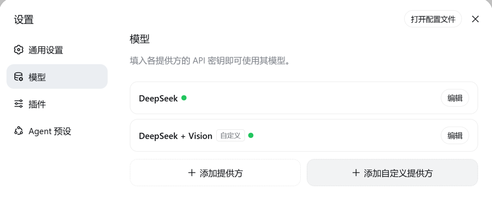
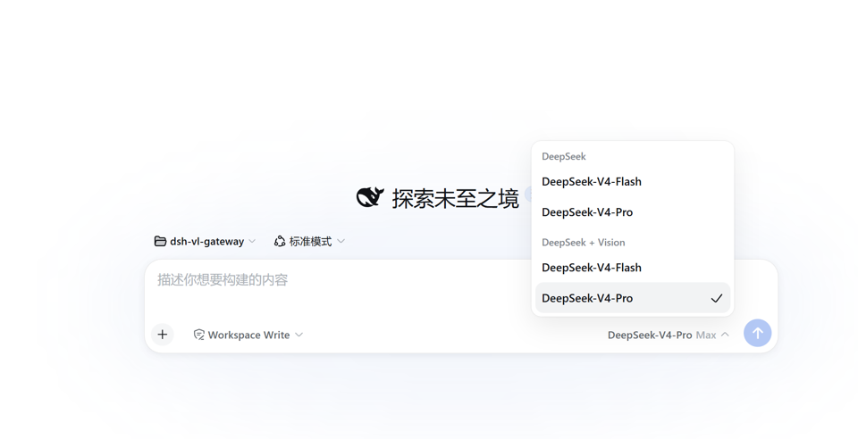
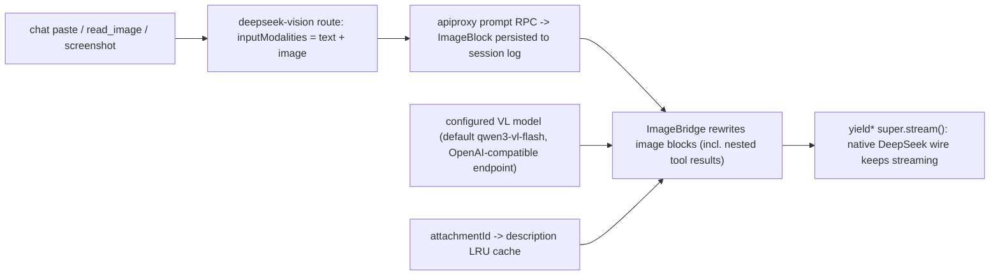
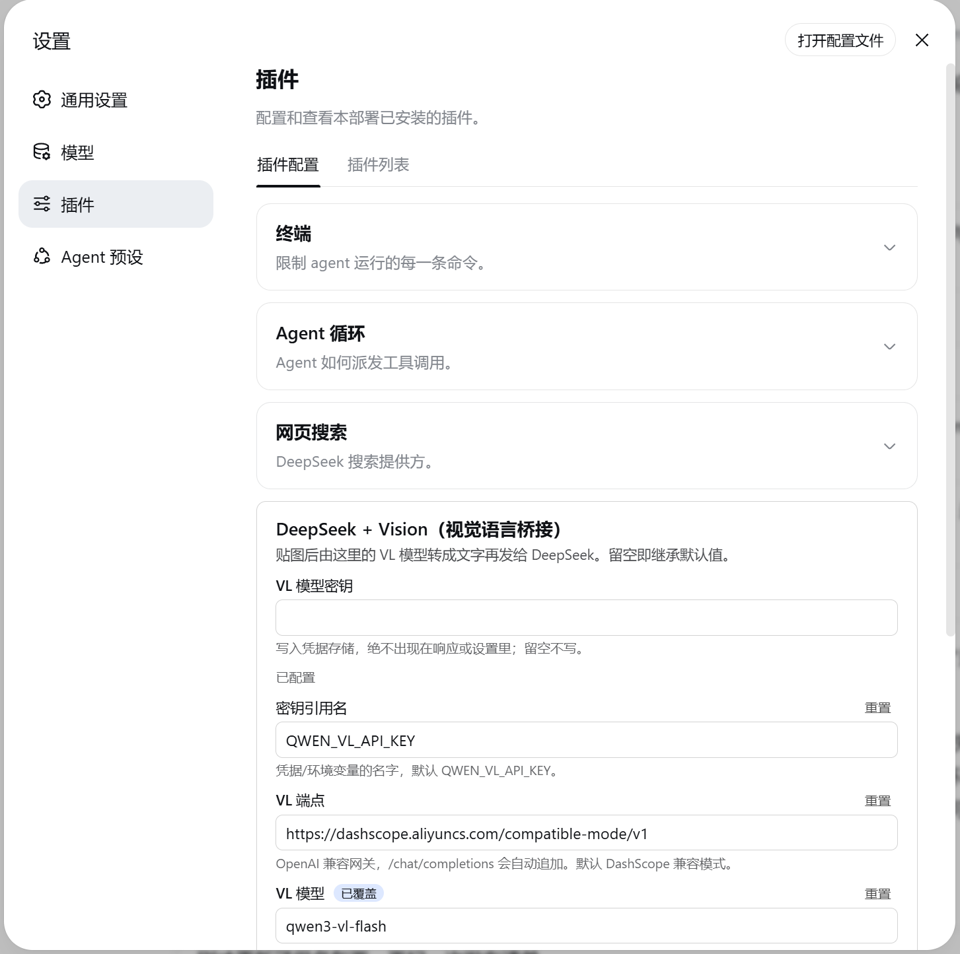

# dsh-deepseek-vision

[](https://github.com/deepseek-ai/deepseek-harness)
[](./CHANGELOG.md)
[](./tests)
[](./vitest.config.ts)
[](./LICENSE)
[](./package.json)
[](./cordis.patch.yml)

**Install:** `dsh plugin --profile web add dsh-deepseek-vision`

**A vision-language gateway plugin for DeepSeek Harness.** A text-only DeepSeek coding
model gains image support through a "gateway" provider route: pasted images are first
described verbatim by a configurable VL model (Qwen-VL by default), then the description
replaces the image for the DeepSeek wire. Zero changes to the official repo, no version
lock on cross-machine installs. Among the dsh vision plugins it is the **thinnest
bridge**: no injected agent tools, no third-party relay, no local model requirement.

[English](README.en.md) | [中文](README.md)

## Table of Contents

- [Highlights](#highlights)
- [Why This One](#why-this-one)
- [Quick Start](#quick-start)
- [What It Does](#what-it-does)
- [How It Works](#how-it-works)
- [Configuration](#configuration)
- [Usage](#usage)
- [Install](#install)
- [Version Alignment](#version-alignment)
- [Development](#development)
- [Boundaries & Notes](#boundaries--notes)
- [FAQ](#faq)
- [License](#license)

## Highlights

- **Paste an image, keep your model:** registers the `deepseek-vision` route (display name
  *DeepSeek + Vision*) with a real `inputModalities: ['text','image']` declaration — chat
  pastes, `tool-fs read_image`, and browser screenshot tools all get through.
- **Describe each image once:** per-`attachmentId` in-process LRU cache; retries,
  compaction, and later turns reuse the same description — no double billing.
- **Session invariants hold:** original images stay persisted in the session log; history /
  replay / reconstruction are unaffected.
- **Official install mechanism:** bundle declaration + `dsh plugin add`, four spec forms
  (npm / git / directory / tarball), web and headless profiles — the exact same path as
  official plugins.
- **Swap the VL model with zero code:** endpoint / model / prompt / key all live in a
  settings card; any OpenAI-style `/chat/completions` gateway works (DashScope, vLLM,
  OpenRouter, LM Studio…).
- **Explicit failure semantics:** fail-closed by default with stable error codes
  (`AUTH` / `TIMEOUT` / `TRANSPORT` / `IMAGE_TOO_LARGE`…), or `placeholder` to degrade.
- **No cross-version lock-in:** releases do not pin an official dsh version — installs
  rebuild on the target machine against its own dsh; a successful build is the proof of
  compatibility, and pre-install checks grade differences instead of failing silently.

## Why This One

Dozens of dsh vision plugins appeared within hours of the official harness launch, with
different mechanisms and trade-offs. This plugin's position is one sentence: **the
thinnest bridge** — one provider route, and nothing else.

- **No injected agent tools:** no `vision_describe` / `analyze_image`-style tools; the
  agent's behavior surface is unchanged, and pasting an image stays the plain "paste"
  path.
- **No third-party relay:** no anonymous fallback endpoints, no proxy servers, no
  on-disk answer cache — images only ever pass through **the VL endpoint you
  configured** (your key, your endpoint, your data).
- **No local model dependency:** no Python / MLX / llama.cpp / Ollama requirements;
  install and go.
- **Official-grade release quality:** official bundle install mechanism, pre-install
  compatibility gates, build-anchor stamp, 102 tests / 97% coverage, bilingual docs.

| Dimension | This plugin | Tool-style (e.g. [dsh-vision-any](https://github.com/tianmingwan/dsh-vision-any), [dsh-vision](https://github.com/linenxi-ctrl/dsh-vision)) | Router-style (e.g. [dsh-vision-router](https://github.com/ysr666/dsh-vision-router)) | Proxy-style (e.g. [dsh-vision-proxy](https://github.com/Flyvhidbwo/dsh-vision-proxy)) | Local-pipeline (e.g. [DeepSeek-Harness-Vision-Tools](https://github.com/tonyd2wild/DeepSeek-Harness-Vision-Tools)) |
| --- | --- | --- | --- | --- | --- |
| Mechanism | provider gateway route | injected agent tools | tools + multi-provider routing | transparent proxy route | Python local VLM pipeline |
| Image data flow | your VL endpoint only | your own API | includes a third-party anonymous fallback | own endpoint + fallback chains | local model, never leaves the machine |
| Swap VL model | settings card, zero code | config files | config files | config + Ollama auto-detect | swap local model |
| Answer/description cache | in-process LRU (descriptions only) | — | content-hash answer cache | SHA-256 cache | — |
| Failure semantics | fail-closed + stable error codes | — | — | timeout protection | — |
| Release path | official bundle mechanism + compat gates + anchor stamp | — | — | — | non-bundle |

> The table lists directional differences only; every project is iterating fast — check
> each project's latest README before choosing.

## Quick Start

Prerequisites: the `dsh` CLI available and booted at least once, `pnpm` on PATH
(`dsh plugin` installs plugins through pnpm).

**Step 1 — install `dsh` on a new machine (one-time, pick one).** `dsh` is the
official CLI (npm package `@deepseek-ai/dsh`):

```sh
npm install -g @deepseek-ai/dsh        # recommended: dsh permanently on PATH
# or (the official one-line launch):
npx @deepseek-ai/dsh web               # no global install: CLI lives only in npx cache
```

> ⚠️ With the `npx` form, `dsh` does **not** enter PATH — a fresh terminal typing
> bare `dsh` fails with "command not found". Either install globally, or prefix
> every command with `npx @deepseek-ai/dsh`.

**Step 2 — install** (from npm — the recommended path):

```sh
dsh plugin --profile web add dsh-deepseek-vision
# without a global install, use the npx prefix:
npx @deepseek-ai/dsh plugin --profile web add dsh-deepseek-vision
```

**Deploy & use:** restart `dsh web` once → pick **DeepSeek + Vision** on the Models
page → fill the VL key in **Settings → Plugins → Plugin settings** → paste an image
and send.

**Uninstall:**

```sh
dsh plugin --profile web remove dsh-deepseek-vision
```

Headless profiles, the other spec forms (git / directory / tarball), and machines
without the CLI — see [Install](#install).

## What It Does

Select the **DeepSeek + Vision** provider in the chat:

|  |  |
| :---: | :---: |

- **paste / drop an image** → the configured VL model describes it first (verbatim code,
  errors, logs, UI text, plus layout);
- the description replaces the image for DeepSeek → you keep coding with DeepSeek while
  gaining image understanding;
- each image is described once and the result is reused across retries and turns;
- the session log still persists the original images.

## How It Works



Why a gateway adapter instead of middleware: DSH has two hard gates — the `prompt` /
`selectModel` RPC rejects models whose `inputModalities` lacks `image`, and the
llm-deepseek serializer throws `UNSUPPORTED_CONTENT` on image blocks. This plugin
registers a new provider route that extends the officially exported `DeepSeekAdapter`,
rewrites image blocks to text inside `stream()`, then delegates to the pristine DeepSeek
wire; reasoning efforts, context window, default maxTokens, and retry policy are
inherited from the parent.

## Configuration

Everything is optional (defaults apply). Both keys support credential-refs (environment
variable names). When dsh's `credentials` service is mounted, its result is authoritative,
including an unconfigured result; the route reads the launch environment directly only when
that service is absent. Official `credentials-local` precedence is: **process environment
(highest, read-only) → GUI-managed `.credentials.yaml` → `.env` fallback**. Credentials
written on the Web Models page therefore work, while a key explicitly exported for this
process always wins and cannot be changed in the GUI:

| Path | Default | Notes |
| --- | --- | --- |
| `provider` | `deepseek-vision` | registered route id (avoids `deepseek-official`) |
| `displayName` | `DeepSeek + Vision` | name in the model picker |
| `deepseek.*` | — | identical shape to the official `llm-deepseek` section (apiKeyEnv / baseURL / thinking / reasoningEffort / maxTokens / models / retryPolicy…) |
| `deepseek.apiKeyEnv` | `DEEPSEEK_API_KEY` | DeepSeek key |
| `vl.apiKeyEnv` | `QWEN_VL_API_KEY` | VL model key |
| `vl.baseURL` | `https://dashscope.aliyuncs.com/compatible-mode/v1` | any OpenAI-compatible `/chat/completions` gateway |
| `vl.model` | `qwen3-vl-flash` | VL model id (best price for OCR-style descriptions; use `qwen-vl-max` for hard visual reasoning) |
| `vl.describePrompt` | detailed English prompt with verbatim extraction | the description instruction |
| `vl.timeoutMs` | `120000` | hard timeout per description request |
| `vl.maxCacheEntries` | `64` | in-process description cache capacity (LRU) |
| `vl.onFailure` | `fail` | `fail` = failed description fails the request; `placeholder` = degrade to a text placeholder |

`llm-vl-gateway` is also a settings namespace with three edit entry points: the
**Settings → Plugins → Plugin settings** card ("DeepSeek + Vision", all `vl.*` fields +
VL key), the Web Models page (the `deepseek.*` subsection is rendered by the configurable
provider directory), and `settings.yaml` (both subsections).

`provider` / `displayName` are registration-time facts: edits apply immediately (the
adapter route and the configurable provider directory are re-registered atomically, no
restart); a conflicting route id keeps both registries on their old values and logs why.

Inline patch config example (all optional):

```yaml
- insert:
    - id: llm-vl-gateway
      name: dsh-deepseek-vision
      config:
        deepseek:
          reasoningEffort: high
        vl:
          apiKeyEnv: DASHSCOPE_API_KEY
          model: qwen3-vl-flash
```

## Usage

1. Set two keys: fill the VL key in the **Settings → Plugins → Plugin settings** card
   (stored in the credential store, never echoed); reuse the existing DeepSeek credential;
2. pick the **DeepSeek + Vision** provider on the Models page (per-session selection
   persists as the default);
3. paste an image and send — it is described automatically; DeepSeek sees text.

The settings card is this plugin's **client face** (`dsh.client`): it registers into the
`settings.plugin.item` slot the same way official decoupled plugins do, and edits the
`llm-vl-gateway.vl` section with the same interaction model as built-in cards (drafts,
override state, save-as-a-whole).



## Install

Installation uses the **official bundle mechanism**: the package declares
`dsh.bundle.patch` (pointing at the bundled `cordis.patch.yml`); `dsh plugin add` links
the package into the profile and reconciles the package name into the profile manifest's
`dsh.profile.bundles` layer stack. **No manual `cordis.patch.yml` edits** (managed blocks
from older versions are migrated away automatically on the next install/uninstall).

Any of the official spec forms works — pick one:

```sh
dsh plugin --profile web add dsh-deepseek-vision                          # npm (recommended)
dsh plugin --profile web add github:siegfly/dsh-deepseek-vision#<sha>       # git, pinned commit
dsh plugin --profile web add file:<repo path>                        # local directory (dev)
dsh plugin --profile web add ./dsh-deepseek-vision-<version>.tgz              # tarball
```

Headless profiles work the same: `dsh plugin --profile headless add dsh-deepseek-vision`
(the client card is web-only). Verify the bundle layer mounted:
`dsh --profile web --dump-config | grep llm-vl-gateway`. Uninstall mirrors install for
every form: `dsh plugin --profile <name> remove dsh-deepseek-vision`.

Without the CLI, use the equivalent replica (needs Node 22.19+ or 24+ and `pnpm` on PATH; init layout → pnpm add → bundles reconcile):

```powershell
pnpm install        # devDeps only (typescript/vitest), never @deepseek-ai/*
pnpm install-profile          # or node scripts/install-profile.mjs [profile] [dshHome]
```

Both paths do the same thing: link `dsh-deepseek-vision` into the profile's node_modules
(runtime `@deepseek-ai/*` imports resolve through the official healed fallback to the
**same** dsh install — one shared cordis instance, no dual-instance issues); reconcile the
package into `dsh.profile.bundles`; and, when the profile layout is missing, create it with
official `initProfile` semantics (manifest + empty user patch layer +
`pnpm-workspace.yaml`) — **existing files are never touched**.

> This repository is an independent git repository with no git relationship to the
> official deepseek-harness repo (no fork / submodule / remote); the official checkout is
> never modified.

## Version Alignment

Runtime `@deepseek-ai/*` imports resolve from **the target machine's own dsh install**
(healed fallback), and the installer **rebuilds the plugin on the target machine with the
target machine's own dsh types** before checking. Therefore:

> **Releases pin no official version** — installs proceed on newer (or older) official dsh;
> a successful build is itself the compatibility proof. A future official release that
> changes an API this plugin uses fails the build with a clear tsc error — only then is a
> new release needed.

- `dshCompat.anchorVersion` records the build provenance of the committed `lib/` — a
  provenance note, not an install gate; `lib/build-anchor.json` (written by `pnpm build`)
  keeps that provenance honest.
- `node scripts/check-compat.mjs [dshHome]` grades the target machine before install:
  exact match = exit 0; any difference = exit 1, advisory, proceed; unbuilt release or
  preset drift = refuse (env overrides available).

Full policy, exit-code grades, and release triggers: [docs/VERSIONING.md](docs/VERSIONING.md).

## Development

```powershell
pnpm test      # vitest
pnpm build     # tsc (host + client) + tsdown browser bundle
```

- `scripts/harness-paths.mjs` is the repo's only resolution seam: `$DSH_CHECKOUT` →
  repo-root `harness-paths.json` (gitignored) → the installed dsh's healed fallback.
- On npm-only machines the 2 client test suites self-skip (npm ships the client runtime
  browser-only); machines with the official checkout run the full suite.
- Built artifacts keep bare `@deepseek-ai/*` specifiers resolved through the profile
  fallback at runtime.

Details: [docs/DEVELOPMENT.md](docs/DEVELOPMENT.md). Contributing:
[CONTRIBUTING.md](CONTRIBUTING.md); security reporting: [SECURITY.md](SECURITY.md).

## Boundaries & Notes

- **compaction**: inherits the session provider (the gateway route) by default — images
  are rewritten and hit the cache; explicitly pinning compaction to `deepseek-official`
  with images in history fails with `UNSUPPORTED_CONTENT` as before.
- **image-history sessions after uninstall**: after the plugin is removed, a session whose
  history contains images cannot switch back to a text-only model (the official
  `selectModel` gate rejects by `inputModalities` — expected behavior, not data loss);
  new sessions are unaffected, and reinstalling restores the gateway route.
- **VL failure semantics**: fail-closed by default — a failed description (e.g. dead key)
  aborts the request with a stable code (`AUTH` / `TIMEOUT` / `TRANSPORT`…) instead of
  silently dropping the image; `onFailure: placeholder` degrades.
- **image limit fast-fail**: oversized images (per deployment `ctx.attachments.imageLimits`)
  fail with `IMAGE_TOO_LARGE` before base64 encoding, instead of shipping megabyte data
  URLs to the VL endpoint. No downsampling (no public seam for it); images within the
  deployment limit can still exceed the VL provider's own size cap — mind `vl.timeoutMs`
  and the provider docs.
- Descriptions consume DeepSeek context (a few hundred tokens per image, billed once).

## FAQ

**`dsh` is missing / "command not found" on a new machine?** Install the official CLI
first: `npm install -g @deepseek-ai/dsh` (one-time; `dsh` stays on PATH afterwards). If
you launch via `npx @deepseek-ai/dsh web` (the official one-line way), the CLI runs only
from the npx cache and is **not on PATH** — use the npx prefix for plugin commands:
`npx @deepseek-ai/dsh plugin --profile web add dsh-deepseek-vision`. The plugin itself
lives in the profile, independent of where the CLI comes from; one install is permanent.

**Do I need to care about Node versions to install it?** Not for the official path
(`dsh plugin add`); only the no-CLI replica needs Node 22.19+ / 24+ and `pnpm` on PATH.

**What does `#<sha>` mean?** A placeholder in the git spec form — replace it with a
commit hash to pin an exact snapshot; everyday use just takes the npm form.

**Does it support the CLI (headless)?** Yes. The gateway route behaves identically in
both profiles; the settings card is web-only, and headless configures via `settings.yaml`.

**After uninstalling, a session with image history cannot pick a model?** Expected: the
official `selectModel` gate rejects text-only models for image-bearing sessions. New
sessions are unaffected; reinstalling restores the gateway route.

**Why not send the image to DeepSeek directly?** The official DeepSeek API is text-only
(rejects `image_url`), so a VL model describes the image first — no model swap, no
information loss.

## License

[MIT](./LICENSE)
