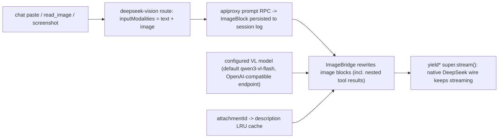

# dsh-vl-gateway

[](https://github.com/deepseek-ai/deepseek-harness)
[](./CHANGELOG.md)
[](./tests)
[](./LICENSE)
[](./package.json)
[](./cordis.patch.yml)

**Install:** `dsh plugin --profile web add dsh-vl-gateway`

**A vision-language gateway plugin for DeepSeek Harness.** A text-only DeepSeek coding
model gains image support through a "gateway" provider route: pasted images are first
described verbatim by a configurable VL model (Qwen-VL by default), then the description
replaces the image for the DeepSeek wire. Zero changes to the official repo, no version
lock on cross-machine installs.

[中文](README.md) | [English](README_EN.md)

## Highlights

- **Paste an image, keep your model:** registers the `deepseek-vision` route (display name
  *DeepSeek + Vision*) with a real `inputModalities: ['text','image']` declaration — chat
  pastes, `tool-fs read_image`, and browser screenshot tools all get through.
- **Describe each image once:** per-`attachmentId` in-process LRU cache; retries,
  compaction, and later turns reuse the same description — no double billing.
- **Session invariants hold:** original images stay persisted in the session log; history /
  replay / reconstruction are unaffected.
- **Official install mechanism:** bundle declaration + `dsh plugin add`, four spec forms
  (npm / git / directory / tarball), web and headless profiles — the exact same path as
  official plugins.
- **Swap the VL model with zero code:** endpoint / model / prompt / key all live in a
  settings card; any OpenAI-style `/chat/completions` gateway works (DashScope, vLLM,
  OpenRouter, LM Studio…).
- **Explicit failure semantics:** fail-closed by default with stable error codes
  (`AUTH` / `TIMEOUT` / `TRANSPORT` / `IMAGE_TOO_LARGE`…), or `placeholder` to degrade.
- **No cross-version lock-in:** releases do not pin an official dsh version — installs
  rebuild on the target machine against its own dsh; a successful build is the proof of
  compatibility, and pre-install checks grade differences instead of failing silently.

## Quick Start

Prerequisites: dsh installed and booted at least once, `pnpm` on PATH, Node 22.19+ or 24+.

```sh
# Official bundle mechanism — any spec form (the npm one after publishing)
dsh plugin --profile web add dsh-vl-gateway                          # npm
dsh plugin --profile web add github:<you>/dsh-vl-gateway#<sha>       # git, pinned commit
dsh plugin --profile web add file:<repo path>                        # local directory (dev)
dsh plugin --profile web add ./dsh-vl-gateway-0.1.0.tgz              # tarball

# Verify the bundle layer is mounted
dsh --profile web --dump-config | grep llm-vl-gateway

# headless works the same (dsh run defaults to headless; the client card is web-only)
dsh plugin --profile headless add dsh-vl-gateway
```

Machines without the CLI: `pnpm install-profile` (an equivalent replica of the official
flow, see [Install](#install)). **Restart `dsh web` once** after installing. Uninstall:
`dsh plugin --profile web remove dsh-vl-gateway` (or `pnpm uninstall-profile`).

## What It Does

Select the **DeepSeek + Vision** provider in the chat:

- **paste / drop an image** → the configured VL model describes it first (verbatim code,
  errors, logs, UI text, plus layout);
- the description replaces the image for DeepSeek → you keep coding with DeepSeek while
  gaining image understanding;
- each image is described once and the result is reused across retries and turns;
- the session log still persists the original images.

## How It Works



Why a gateway adapter instead of middleware: DSH has two hard gates — the `prompt` /
`selectModel` RPC rejects models whose `inputModalities` lacks `image` (a plain `llm/stream`
middleware never sees that stage), and the llm-deepseek serializer throws
`UNSUPPORTED_CONTENT` on image blocks. This plugin registers a new provider route that
extends the officially exported `DeepSeekAdapter`, rewrites image blocks to text inside
`stream()`, then delegates to the pristine DeepSeek wire; reasoning efforts, context
window, default maxTokens, and retry policy are inherited from the parent.

## Configuration

Everything is optional (defaults apply). Both keys support credential-refs (environment
variable names) resolved through dsh's credentials seam (credentials written on the Web
Models page work), falling back to launch-time environment variables:

| Path | Default | Notes |
| --- | --- | --- |
| `provider` | `deepseek-vision` | registered route id (avoids `deepseek-official`) |
| `displayName` | `DeepSeek + Vision` | name in the model picker |
| `deepseek.*` | — | identical shape to the official `llm-deepseek` section (apiKeyEnv / baseURL / thinking / reasoningEffort / maxTokens / models / retryPolicy…) |
| `deepseek.apiKeyEnv` | `DEEPSEEK_API_KEY` | DeepSeek key |
| `vl.apiKeyEnv` | `QWEN_VL_API_KEY` | VL model key |
| `vl.baseURL` | `https://dashscope.aliyuncs.com/compatible-mode/v1` | any OpenAI-compatible `/chat/completions` gateway |
| `vl.model` | `qwen3-vl-flash` | VL model id (best price for OCR-style descriptions; use `qwen-vl-max` for hard visual reasoning) |
| `vl.describePrompt` | detailed English prompt with verbatim extraction | the description instruction |
| `vl.timeoutMs` | `120000` | hard timeout per description request |
| `vl.maxCacheEntries` | `64` | in-process description cache capacity (LRU) |
| `vl.onFailure` | `fail` | `fail` = failed description fails the request; `placeholder` = degrade to a text placeholder |

`llm-vl-gateway` is also a settings namespace with three edit entry points: the
**Settings → Plugins → Plugin settings** card ("DeepSeek + Vision", all `vl.*` fields +
VL key), the Web Models page (the `deepseek.*` subsection is rendered by the configurable
provider directory), and `settings.yaml` (both subsections).

`provider` / `displayName` are registration-time facts: edits apply immediately (the
adapter route and the configurable provider directory are re-registered atomically, no
restart); a conflicting route id keeps both registries on their old values and logs why.

Inline patch config example (all optional):

```yaml
- insert:
    - id: llm-vl-gateway
      name: dsh-vl-gateway
      config:
        deepseek:
          reasoningEffort: high
        vl:
          apiKeyEnv: DASHSCOPE_API_KEY
          model: qwen3-vl-flash
```

## Usage

1. Set two keys: fill the VL key in the **Settings → Plugins → Plugin settings** card
   (stored in the credential store, never echoed); reuse the existing DeepSeek credential;
2. pick the **DeepSeek + Vision** provider on the Models page (per-session selection
   persists as the default);
3. paste an image and send — it is described automatically; DeepSeek sees text.

The settings card is this plugin's **client face** (`dsh.client`): it registers into the
`settings.plugin.item` slot the same way official decoupled plugins do, and edits the
`llm-vl-gateway.vl` section with the same interaction model as built-in cards (drafts,
override state, save-as-a-whole).

## Install

Installation uses the **official bundle mechanism**: the package declares
`dsh.bundle.patch` (pointing at the bundled `cordis.patch.yml`); `dsh plugin add` links
the package into the profile and reconciles the package name into the profile manifest's
`dsh.profile.bundles` layer stack. **No manual `cordis.patch.yml` edits** (managed blocks
from older versions are migrated away automatically on the next install/uninstall).

Without the CLI, use the equivalent replica (init layout → pnpm add → bundles reconcile):

```powershell
pnpm install        # devDeps only (typescript/vitest), never @deepseek-ai/*
pnpm install-profile          # or node scripts/install-profile.mjs [profile] [dshHome]
```

Both paths do the same thing: link `dsh-vl-gateway` into the profile's node_modules
(runtime `@deepseek-ai/*` imports resolve through the official healed fallback to the
**same** dsh install — one shared cordis instance, no dual-instance issues); reconcile the
package into `dsh.profile.bundles`; and, when the profile layout is missing, create it with
official `initProfile` semantics (manifest + empty user patch layer +
`pnpm-workspace.yaml`) — **existing files are never touched**.

> This repository is an independent git repository with no git relationship to the
> official deepseek-harness repo (no fork / submodule / remote); the official checkout is
> never modified.

## Version Alignment (cross-machine installs)

Runtime `@deepseek-ai/*` imports resolve from **the target machine's own dsh install**
(healed fallback), and the install script **rebuilds the plugin on the target machine with
the target machine's own dsh types** before checking. Therefore:

> **Releases pin no official version** — installs proceed on newer (or older) official dsh;
> a successful build is itself the compatibility proof. If a future official release
> changes an API this plugin uses, the build fails with a clear tsc error, and only then is
> a new release needed. **The author never has to follow official upgrades.**

- `dshCompat.anchorVersion` (currently `0.1.0-rc.5`) only declares the build provenance of
  the committed `lib/` — provenance, not an install gate;
- **the build stamp cannot lie**: `pnpm build` writes the actually resolved dsh version
  into the committed `lib/build-anchor.json`. check-compat grades it: equal → OK;
  different → advisory (expected after a target-machine rebuild); missing → exit 2,
  install refused (an unbuilt release).
- **compatibility check** (runs automatically on install, or standalone):
  ```powershell
  node scripts/check-compat.mjs [dshHome]
  ```
  Reads the actual versions of `dsh` / `dsh-llm` / `dsh-llm-deepseek` /
  `dsh-client-ui-settings-plugins` under `$DSH_HOME/profiles/node_modules` and grades them
  against the anchor: all equal = exit 0; **any difference = exit 1, advisory, proceed**.
  `install-profile` refuses on exit 2/3 (`DSH_VL_GATEWAY_FORCE=1` overrides); conservative
  users may set `DSH_VL_GATEWAY_STRICT=1` to also refuse on exit 1. When an official source
  checkout is present, the check also diffs the frozen client bundle preset replica against
  the official preset (unpublished; version numbers cannot show this drift), exit 3.
- Tag each release `v<plugin-version>-dsh-rc<N>` (e.g. `v0.1.0-dsh-rc5`) — the tag is a
  frozen historical label that never needs to follow official updates.

**When a new release is actually needed**: only two cases — ① a new official release
changes an API this plugin uses so the target build fails (adapt, then release); ② the
official client bundle preset drifts (update the frozen replica, rebuild, release).
"Official bumped a version number" alone is never a release reason.

## Development

```powershell
pnpm test      # vitest; @deepseek-ai/* resolved via vitest.config.ts + scripts/harness-paths.mjs (tests only)
pnpm build     # harness-paths --write + tsc (host + client) + tsdown (lib/client.js browser factory bundle)
```

- **Where harness types come from** (`scripts/harness-paths.mjs`, the repo's only
  resolution seam, no hardcoded paths), in order: `$DSH_CHECKOUT` env → repo-root
  `harness-paths.json` (gitignored, machine-private) → the **installed dsh**
  (`$DSH_HOME/profiles/node_modules` healed fallback). With none of the three, build/test
  prints guidance and stops.
- Built artifacts keep bare `@deepseek-ai/*` specifiers resolved through the profile
  fallback at runtime — the type-resolution seam affects development only.
- **Test surface on npm-only machines**: the published official client packages ship the
  client runtime only inside browser bundles, so Node cannot execute the official client
  runtime (official client tests need the source checkout too). The 2 client suites skip
  themselves there; the rest always run. Machines with the official checkout (dev / CI)
  run the full suite.
- `tsdown.config.ts` replicates the unpublished official
  `packages/client/tsdown.client.ts` preset: `window.__ModuleLoader__.load({id, factory})`
  closure factory, platform modules external, everything else inlined; it never imports
  build files from the official repo.
- After code changes: `pnpm build && pnpm install-profile`; new/changed `dsh.client`
  declarations need a dsh web restart.

## Boundaries & Notes

- **compaction**: inherits the session provider (the gateway route) by default — images
  are rewritten and hit the cache; explicitly pinning compaction to `deepseek-official`
  with images in history fails with `UNSUPPORTED_CONTENT` as before.
- **VL failure semantics**: fail-closed by default — a failed description (e.g. dead key)
  aborts the request with a stable code (`AUTH` / `TIMEOUT` / `TRANSPORT`…) instead of
  silently dropping the image; `onFailure: placeholder` degrades.
- **image limit fast-fail**: oversized images (per deployment `ctx.attachments.imageLimits`)
  fail with `IMAGE_TOO_LARGE` before base64 encoding, instead of shipping megabyte data
  URLs to the VL endpoint. No downsampling (no public seam for it); images within the
  deployment limit can still exceed the VL provider's own size cap — mind `vl.timeoutMs`
  and the provider docs.
- Descriptions consume DeepSeek context (a few hundred tokens per image, billed once).

## License

[MIT](./LICENSE)
